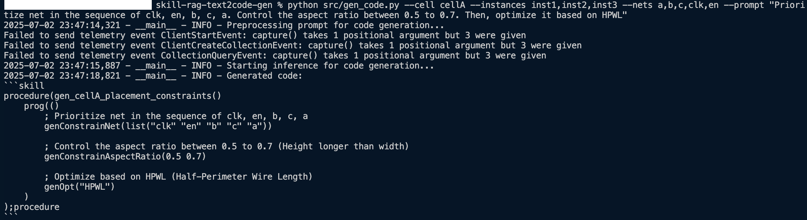
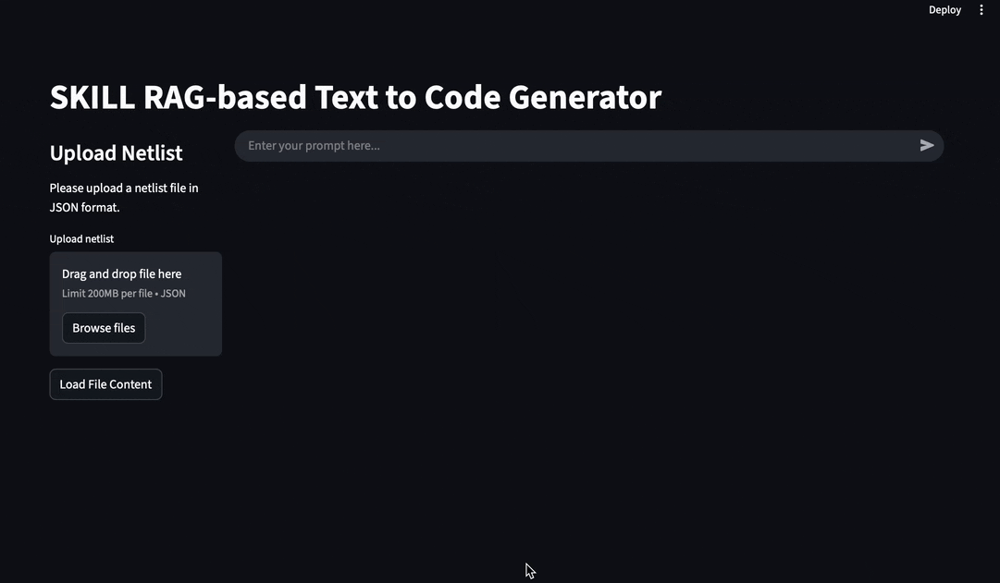

# SKILL RAG-based Text to Code Generator


## 🌟 Overview

This project showcases an **intelligent Cadence SKILL text to code generator** powered by **Retrieval-Augmented Generation (RAG)**. It accelerates user familiarity with new or unfamiliar APIs by dynamically referencing relevant documentation for context and practical code examples.


## ✨ Features

* **Rapid API Onboarding:** Quickly ramp up on new or unfamiliar Cadence SKILL APIs.
* **Dynamic Documentation Integration:** Easily populate and update multiple documentation sources into the database for reference.
* **Flexible LLM Support:** Features a hotswappable Large Language Model (LLM) module for easy integration with different models.
* **Interactive Dashboard:** Includes an example Streamlit dashboard for intuitive code generation and interaction.


## 🚀 Getting Started

Follow these steps to set up and run the SKILL RAG-based text to code generator.

### Prerequisites

Before you begin, ensure you have the following:

* **LLM API Service:** This project uses the **Google Gemini API**. You will need an API key to configure the environment.

### Installation

```bash
# Clone the repository
git clone https://github.com/izaq09/skill-rag-text2code-gen.git

# Navigate into the project directory
cd skill-rag-text2code-gen

# Create and activate a virtual environment (highly recommended)
python -m venv src_env
# On Windows: src_env\Scripts\activate
# On macOS/Linux: source src_env/bin/activate

# Install project dependencies
pip install -r requirements.txt

# Create a .env file in the project root to store your API key
touch .env

# Add your LLM API key to the .env file.
# For Google Gemini API, add the following line:
# GOOGLE_API_KEY=<YOUR_API_KEY>
```

### Running the Program

**Setting up documentation database**

1. Copy your **documentation files** (e.g., Cadence SKILL reference manuals, custom API guides) into the ```data``` folder. (Markdown (```.md```) format is currently supported. The code can be adapted to support other formats like PDF.)
2. Populate the database with your documentation: 
```bash
python src/populate_database.py
```

**Running Code Generation from Command Line**

Use the ```gen_code.py``` script to generate SKILL code directly.

> [!Note]
> The ```cell```, ```instances``` and ```nets``` specified below are dummy values for demonstration purposes. 

```bash
python src/gen_code.py --cell cellA --instances inst1,inst2,inst3 --nets a,b,c,clk,en --prompt "Prioritize net in the sequence of clk, en, b, c, a. Control the aspect ratio between 0.5 to 0.7. Then, optimize it based on HPWL"
```

Example Output:



**Starting the Streamlit Dashboard**

For an interactive, browser-based experience, run the Streamlit dashboard:
```bash
streamlit run src/streamlit_app.py
```

**Using the Streamlit Dashboard for Code Generation**

1. **Upload** a dummy netlist file via the file uploader. (The netlist used in this project is a dummy written in **JSON format** for demonstration purposes.)
2. Click "**Load File Content**".
3. **Select** the desired cell, instances and nets from the provided selectboxes.
4. Enter your **prompt** to generate code.

Example Output:



> [!Caution]
> **Always carefully review any code generated by this tool before using it in a production environment or critical design. While the tool aims for accuracy and relevance, it can make mistakes or produce code that does not perfectly fit your specific design context. Treat generated code as a helpful starting point, not a final solution.**

## 📄 License
This project is licensed under the MIT License. See the LICENSE file for full details.

## 🙏 Acknowledgments
* [Google AI Studio](https://aistudio.google.com/)
* [Pixegami](https://www.youtube.com/@pixegami)
* [IBM](https://www.youtube.com/@IBMTechnology)